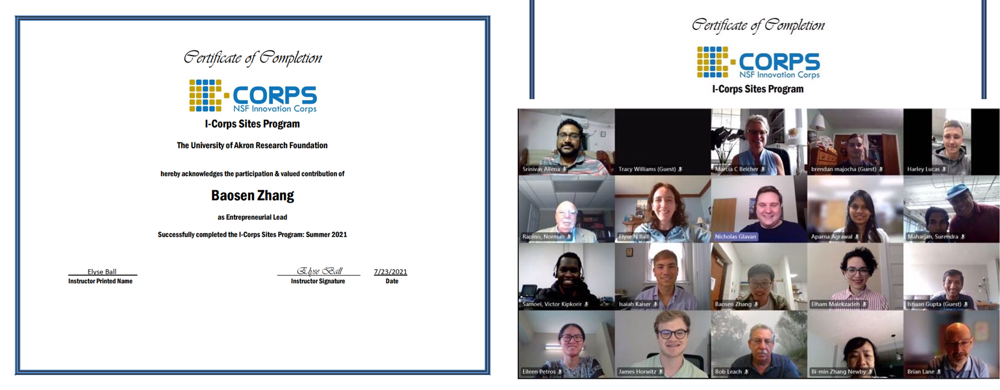

As an entrepreneurial lead of the National Science Foundation Innovation Corps (NSF I-Corps) sites program in Summer 2021, I Interviewed environmental industries and labs to understand markets and identify potential customers, and built a business model for customers who have needs for dangerous micro-organisms auto-detection devices. Our team was finally awarded $2500 in this program. Below are the certificates:      

_Certificates of NSF I-Corps sites program_

The prototype of our devices is demonstrated in our paper published in Journal of Chemical Education published by the Division of Chemical Education of the American Chemical Society. Here is the hyperlink, [Workshop on Computer Vision for Bioanalytical Chemists: Classification and Detection of Amoebae Using Optical Microscopy Image Analysis with Machine Learning](https://pubs.acs.org/doi/abs/10.1021/acs.jchemed.2c00631){:target="_blank"}. Additionally, you can watch this video where the amoeba is detected. Here is the hyperlink, [simple demo of amoeba detection](https://github.com/BaosenZ/amoeba-video-detection/blob/master/output-video/detect-amoeba.mp4){:target="_blank"}. I will stay tuned for more related works that can make chemistry experiments safer!
