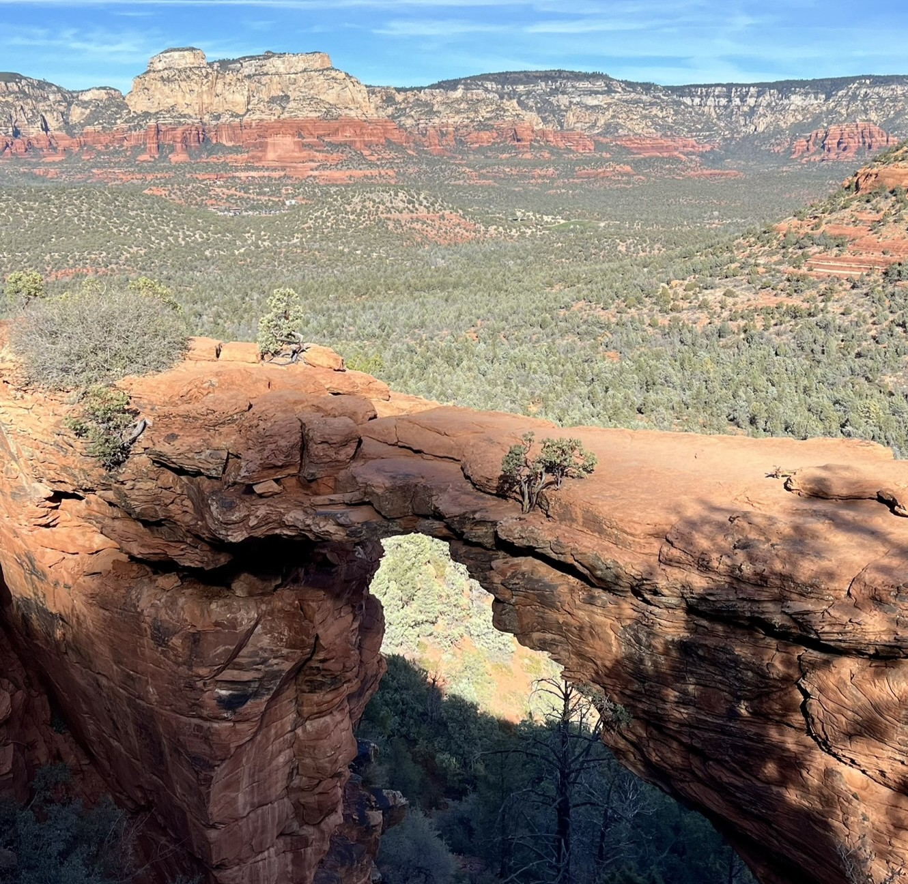

## 1 流水账

### 提前预定(大概1个月)：  
[x] 热气球需要提前预约  
[x] 租车、住宿预定  
[x] pink jeep tour要提前预定，我们Safari jeep tour了  
[x]圣诞晚上餐馆预定

### Day1(12.22)@Phoenix:

(1) ✈️纽约出发抵达PHX机场大概在中午  
我的飞机是早晨6点出发，我昨天晚上到了NY/NJ EWR机场，机场24h checkin在机场长凳上睡了一晚，EWR机场可以过夜，有舒服的长凳，在这里过夜的人也不少。这个机场是我见过最棒的机场了~  
(2) 🚙PHX机场租车SIXT，去超市买水和水果  
(3) 午餐，随便一家中餐  
(4) 🌵Desert Botanical Garden, 2h  
    他们大概5点关门  
(5) 🌄到hole in the rock看日落，这个地方在Papago Park里面

(6) 晚餐参考：the mission old town  
(7) 🏨宾馆checkin，住一晚  

### Day2(12.23)@Phoenix to Sedona: 

(1) PHX住宿checkout@5:30AM  
(2) Rainbow Ryders@6:30AM, sunrise ride   
    在热气球上大喊，吸引力法则了~哈哈  
(3) 早午餐：Sunshine Breakfast Bar  
(4) 出发Sedona，2小时车程  
(5) Chapel of the Holy Cross  
(6) 🧗Bell rock trail  
    我对这个trail印象很深，后半段有点小危险，好多人都是中途放弃的。  
(7) Airport Mesa (能量点，sunset)   
(8) 晚餐：Szechuan, 原计划Dahl&Di Luca  
    这家川菜是不是中国人开的，不过还不错。  
(9) 在Sedona宾馆checkin，3 nights  

### Day3(12.24)@Sedona: 
(1) 蓝色麦当劳打卡, 7:30AM出发  
(2) 😈🧗Mescal trailhead, to Devil's Bridge  
Devil's Bridge不能直接到，不是越野车的话，导航到Mescal trail，慢慢走就好。很容易迷路。  

(3) Tlaquepaque art&crafts village  
很多艺术的小东西，挺好看的。  
(4) 开车去Phoenix，路上解决的午餐  
(5) Petrified Forest National Park石化林  
    没有转完，被人家赶出来了。  
(6) 开车回Sedona

### Day4(12.25圣诞)@Sedona:
(1) 🧗Boynton Canyon trail to subway cave   
(2) Jeep tour落日  
我们pink jeep tour没有预定到，这个要提前订。幸运的而是我们有Safari Jeep tour，那个开车的大哥给我讲了好多故事，还有展示怎么找自己能量点，真的超级棒！ 

(3) 🍚找饭店吃饭  
圣诞找饭店真的难，建议提前预定~

### Day5(12.26)@Sedona to Phoenix
(1) Sedona宾馆checkout@7:30AM  
(2) 启程回PHX机场，2小时车程  
(3) 下午飞机回纽约  

## 2 建议
(1) 💧Arizona空气干燥，有条件可以带个便携的加湿器，网上有卖的。  
(2) 🧴防晒一定要带  
(3) 🗺️下载离线地图，被种草了AllTrails app，挺详细的，而且下载地图也方便。  
(4) 🥶带外套，虽然天气好，但是山高了，或者背阳面，还是非常冷的。  
(5) ❗安全第一！！！

## 3 感受
在AZ一共4天5夜，天天trail。因为自己可能运动能力比较强，就感觉没什么，不过通行的小伙伴有非常累的，并且有些trail真的有挑战。
知道怎么寻找能量点了，如果二刷这个地方的话，可能会在一些能量点多待一会儿吧。

## 4 Reference
1. 【Sedona最火打卡点Devil's Bridge恶魔桥攻略 - 草头三字 | 小红书 - 你的生活指南】 😆 tAAHLB1eXhyjFq5 😆 https://www.xiaohongshu.com/discovery/item/65dc8e39000000000b018ace?source=webshare&xhsshare=pc_web&xsec_token=ABbpqQuQFvBPt2n2EvhkNfiZ60RFGZNj_jYcUrD0iPyYo=&xsec_source=pc_shareab_channel=TechnoTim

