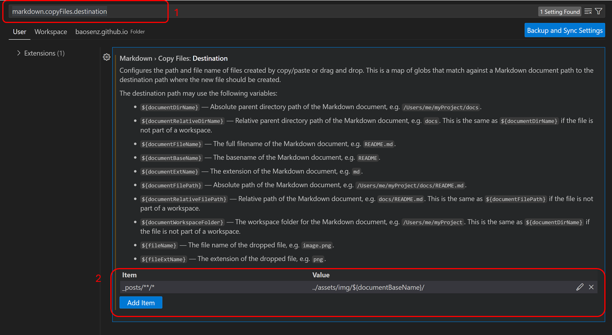

## 1 Introduction

This blog serves as my central hub for sharing and preserving my work. Every technique I post online is backed up here. 

## 2 Guides for Setting Up

This section is the guide of how to setup GitHub Pages for personal blog using Chirpy Jekyll Theme. I used Windows 11. If you used Windows 11, you can just follow along. After this finishing all the steps, here is what you will have:  
{: w="500" h="300" }
_Screenshot of Chirpy Blog_  

### 2.1 GitHub Repo Setup

First, we need to setup the GitHub Repo following the [get-started tutorial by Chirpy](https://chirpy.cotes.page/posts/getting-started/). I used the recommended starter method. The image below is the steps:  
{: w="500" h="300" }
_GitHub Repo Setup steps_  

### 2.2 Local Blog Setup

Install Jekyll locally. I used Windows 11. I can directly use [documentation method posted by Jekyll](https://jekyllrb.com/docs/installation/windows/). RubyInstaller was used. Confirm the installation of Jekyll is complete by `jekyll -v`.   
Then, we git clone our repo locally:
```bash
git clone <repo-github.io-link>
```
If we open with VScode, you could see the folder structure, which could contain `_posts`, `_site`, `assets`, `tools`, and more folders. We change the directory to the github.io link, and execute the jekyll:
```bash
cd <repo-github.io-link>
bundle exec jekyll s
```
Here is the output and you can visualize your blog in address: http://127.0.0.1:4000/:  
{: w="500" h="300" }
_Visualize your blog in address_  

### 2.3 First Hello World Blog

Find out `_config.yml` file in main folder. Change the configurations there following the instructions in the file. We can change the `timezone`, `title`, `url`, `username`, `social`, `avatar`.  
Create our first post `yyyy-mm-dd-blog-title.md` in `_post` folder.  Put our image in `/assets/blog_files/files_blog19950505/sample-image.jpeg` folder. 

```markdown
This is my first blog post using the Chirpy Jekyll theme! 🚀

## Getting Started

This is a test post to explore how Chirpy renders content. Below are some features:

### Markdown Example
We can write **bold text**, *italic text*, or `inline code`. We can write a list:
- Point 1
- Point 2
  - Sub-point 2.1
  - Sub-point 2.2

### Adding an Image
Here’s an image example (make sure the file exists in assets/img/posts/):
{: w="500" h="300" }
_image caption_  
```

### 2.4 GitHub Pages Setup and deploy
Go to the "GitHub repo > Settings > Pages". Setup the branch we want to deploy, usually "main" branch and save it.   
For the deploy, just type the following:
```bash
git add .
# git commit -m <message>, below is the example
git commit -m "first test blog"
git push
```
It will take a minute to deploy. But after it's done, you can go to your github pages to open your sites to check. You should see similar website shown in the first image. 

## 3 Better Use of Chirpy Jekyll Theme

1. If you want to remove "Post Updated date". We can go to `_plugins` folder. Find out `posts-lastmod-hook.rb` file, comment out code related to `last_modified_at`.

2. If we want have a inline image, we need to use `span` HTML. Here is code I add Rednote:
```markdown
I shared this travel experience in <span></span> [RedNote as a travel guide post](https://www.xiaohongshu.com/discovery/item/6770486b000000000901699d?source=webshare&xhsshare=pc_web&xsec_token=ABYJwKkar-FcqNZocrAta0-D_KnYYA1ePeQWorz4yenaY=&xsec_source=pc_share). Hopefully, this could help somebody.
```

Below is the output, you can see the rednote image rendering great:  
I shared this travel experience in <span></span> [RedNote as a travel guide post](https://www.xiaohongshu.com/discovery/item/6770486b000000000901699d?source=webshare&xhsshare=pc_web&xsec_token=ABYJwKkar-FcqNZocrAta0-D_KnYYA1ePeQWorz4yenaY=&xsec_source=pc_share). Hopefully, this could help somebody.  

3. This post from Chirpy is really great source: [https://chirpy.cotes.page/posts/write-a-new-post/](https://chirpy.cotes.page/posts/write-a-new-post/)  

## 4 VS code Settings

I've explored different tools to immerse myself in blog writing and ultimately realized that VS Code is the best choice. I'll be sharing some useful tips on my VS Code setup for blog writing, using version 1.96.4 on Windows 11.

1. If you want to write your post and store you images in `assets` folder automatically, we can refer to the vscode documentation of how to write markdown in vscode editor ([https://code.visualstudio.com/docs/languages/markdown](https://code.visualstudio.com/docs/languages/markdown)). Find "⚙️Settings", type `markdown.copyFiles.destination` in the search field on the top, then click "Workspace" tab. Under "Item", write `_post/**/*`. Under "Value", write `${documentWorkspaceFolder}/assets/blog_files/${documentBaseName}/`, click "Ok" to finish the setting. Below is the image showing the whole process:   


2. We will move or rename our images or files frequently, at that time, you don't want to change the image link manually. We can setup settings in vs code to automatcally track the image or file change and modify the markdown image link. Set `"markdown.updateLinksOnFileMove.enabled": true`. https://code.visualstudio.com/docs/languages/markdown#_automatic-link-updates-on-file-move-or-rename.  Use Absolute Paths from the Workspace Root
Modify your Markdown image links to use absolute paths relative to the workspace, starting with `/`. So when we move files, the image link actually doesn't change. 

3. A VS-Code extention to help us write blogs: "jekyll-post". The "jekyll-post" can help us create blog with a template. Below is instructions:  
> If a user wants to provide a template file for new posts, they should create a file: `.post-template` in the Jekyll project root directory.   
To create a new post, a user must right click on a directory in the explorer menu and select the "New Post" option. Then, a dialog box prompts the user to provide the name of the file.   
Ref: jekyll-post vscode extention

4. Previously, we need to open a Windows terminal and type `bundle exec jekyll s` everytime when we want to check the rendered website. Luckily, with VS Code extention, "**Jekyll Run**", we can simply click the ▶️green start button in the top right corner in VS Code to run jekyll site locally. The browser will open automatically. And you can ⏹️stop the server at the top right corner too. 

5. When lots of posts in the `_post` folder, we can create subfolders based on the year or month like `2023` folder or `202501` folder inside the `_post` to organize locally. When you change your folder, the image will pointed to the right place automatically when you set it up following bullet point 2. So when we move files, the image link actually doesn't change. The  Chirpy Jekyll can still render them without any problems.   

6. Go to Settings, type `sort` and set it to `modified`.   

7. For the images, use extension "**Excalidraw**". I realized this is a great tools for drawing! 

8. We can hide folders and files. Go to Settings, and `Files: Exclude`. "Workspace", Exclue files like
```json
Gemfile
_data
```


## Reference
1. The youtube video and his post are good source to use chirpy Jekyll theme: https://technotim.live/posts/jekyll-docs-site/ and https://www.youtube.com/watch?v=F8iOU1ci19Q&ab_channel=TechnoTim
2. Here is the Chirpy documentation: https://chirpy.cotes.page/posts/getting-started/
3. GitHub Pages get started: https://docs.github.com/en/pages/quickstart
4. Install Jekyll on Windows: https://jekyllrb.com/docs/installation/windows/


