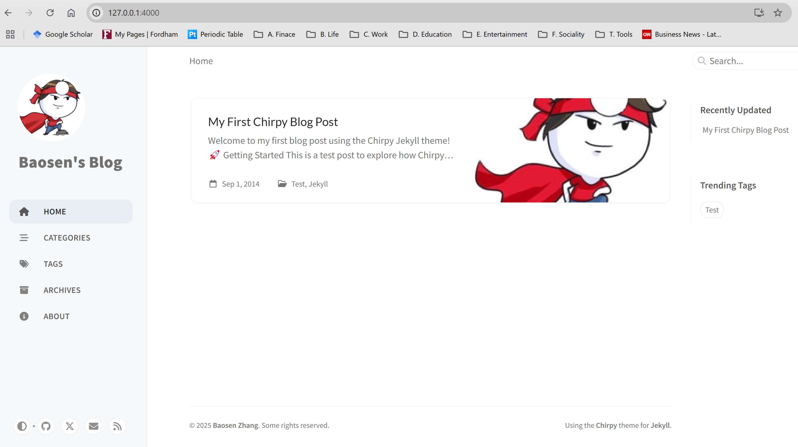

## 1 Introduction

This post is the guide of how to setup GitHub Pages for personal blog using Chirpy Jekyll Theme. I used Windows 11. If you used Windows 11, you can just follow along. After this finishing all the steps, here is what you will have:  
{: w="500" h="300" }
_Screenshot of Chirpy Blog_  

## 2 Guides for Setting Up

### 2.1 GitHub Repo Setup

First, we need to setup the GitHub Repo following the [get-started tutorial by Chirpy](https://chirpy.cotes.page/posts/getting-started/). I used the recommended starter method. The image below is the steps:  
{: w="500" h="300" }
_GitHub Repo Setup steps_  

### 2.2 Local Blog Setup

Install Jekyll locally. I used Windows 11. I can directly use [documentation method posted by Jekyll](https://jekyllrb.com/docs/installation/windows/). RubyInstaller was used. Confirm the installation of Jekyll is complete by `jekyll -v`.   
Then, we git clone our repo locally:
```bash
git clone <repo-github.io-link>
```
If we open with VScode, you could see the folder structure, which could contain `_posts`, `_site`, `assets`, `tools`, and more folders. We change the directory to the github.io link, and execute the jekyll:
```bash
cd <repo-github.io-link>
bundle exec jekyll s
```
Here is the output and you can visualize your blog in address: http://127.0.0.1:4000/:  
{: w="500" h="300" }
_Visualize your blog in address_  

### 2.3 First Hello World Blog

Find out `_config.yml` file in main folder. Change the configurations there following the instructions in the file. We can change the `timezone`, `title`, `url`, `username`, `social`, `avatar`.  
Create our first post `yyyy-mm-dd-blog-title.md` in `_post` folder.  Put our image in `/assets/blog_files/files_blog19950505/sample-image.jpeg` folder. 

```markdown
This is my first blog post using the Chirpy Jekyll theme! 🚀

## Getting Started

This is a test post to explore how Chirpy renders content. Below are some features:

### Markdown Example
We can write **bold text**, *italic text*, or `inline code`. We can write a list:
- Point 1
- Point 2
  - Sub-point 2.1
  - Sub-point 2.2

### Adding an Image
Here’s an image example (make sure the file exists in assets/img/posts/):
{: w="500" h="300" }
_image caption_  
```

### 2.4 GitHub Pages Setup and deploy
Go to the "GitHub repo > Settings > Pages". Setup the branch we want to deploy, usually "main" branch and save it.   
For the deploy, just type the following:
```bash
git add .
# git commit -m <message>, below is the example
git commit -m "first test blog"
git push
```
It will take a minute to deploy. But after it's done, you can go to your github pages to open your sites to check. You should see similar website shown in the first image. 

## 3 Use tips

1. If you want to remove "Post Updated date". We can go to `_plugins` folder. Find out `posts-lastmod-hook.rb` file, comment out code related to `last_modified_at`.
2. If we want have a inline image, we need to use `span` HTML. Here is code I add Rednote:
```markdown
I shared this travel experience in <span></span> [RedNote as a travel guide post](https://www.xiaohongshu.com/discovery/item/6770486b000000000901699d?source=webshare&xhsshare=pc_web&xsec_token=ABYJwKkar-FcqNZocrAta0-D_KnYYA1ePeQWorz4yenaY=&xsec_source=pc_share). Hopefully, this could help somebody.
```
Below is the output, you can see the rednote image rendering great:  
I shared this travel experience in <span></span> [RedNote as a travel guide post](https://www.xiaohongshu.com/discovery/item/6770486b000000000901699d?source=webshare&xhsshare=pc_web&xsec_token=ABYJwKkar-FcqNZocrAta0-D_KnYYA1ePeQWorz4yenaY=&xsec_source=pc_share). Hopefully, this could help somebody.
3. This post from Chirpy is really great source: [https://chirpy.cotes.page/posts/write-a-new-post/](https://chirpy.cotes.page/posts/write-a-new-post/)

## Reference
1. The youtube video and his post are good source to use chirpy Jekyll theme: https://technotim.live/posts/jekyll-docs-site/ and https://www.youtube.com/watch?v=F8iOU1ci19Q&ab_channel=TechnoTim
2. Here is the Chirpy documentation: https://chirpy.cotes.page/posts/getting-started/
3. GitHub Pages get started: https://docs.github.com/en/pages/quickstart
4. Install Jekyll on Windows: https://jekyllrb.com/docs/installation/windows/


