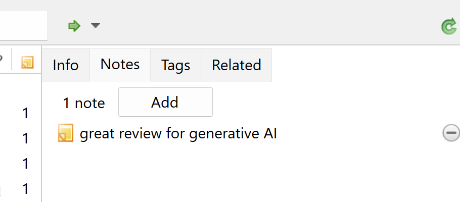
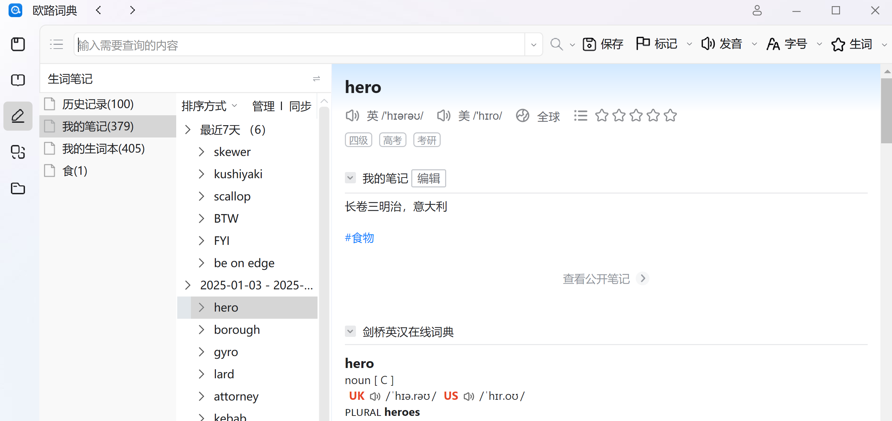
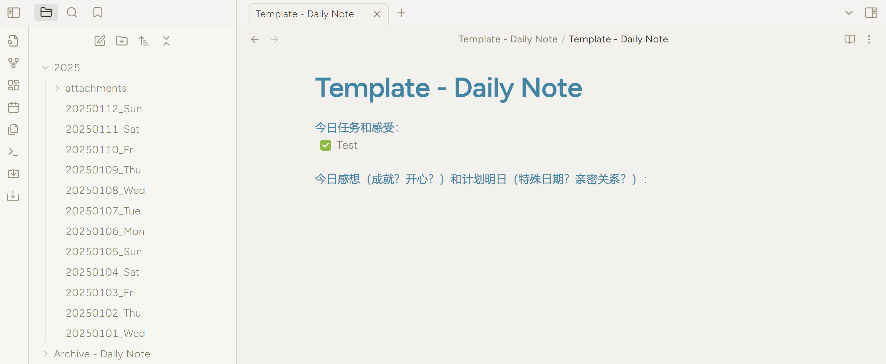

## 1. 写在前面

最近染上了笔记软件，然后浏览了非常多的相关帖子。大学的时候也思考过笔记和知识管理，那个时候开始用Onenote、印象笔记、坚果笔记、苹果PdF viewer。之后各个公司也推出自己的笔记软件，比如有道云笔记。但是随着自己也开始参与科研，发表自己的文章，产出自己知识以后，后来又辅修计算机硕士学位，对软件的认识也加深了。总之，见过的事情越来越多，学到的各个领域的内容越来越多，感觉~世界的确就像马斯克说的那样，是个草太班子。

回到笔记软件上面，我开始意识到个人数据的重要性。公司破产、云服务关闭等情况可能会发生。然后我们将不得不迁移数据，否则我们自己的所有数据都将丢失。一个云服务的同步功能可能会出错，然后我们的数据也会意外丢失。我曾经就在用PDF viewer的时候因为电脑和手机iCloud同步的问题，丢失过数据。浏览过帖子的也应该见过，像老牌笔记软件大公司Onenote和Evernote都出现过莫名其妙丢失数据的问题。如果随笔还好，如果是知识管理，日记这样的东西，里面有你重要的知识，要回忆的东西，丢失数据对我们个人来说真的特别麻烦的事情。

所以，我想写这个Blog，分享一些自己对于笔记和知识管理的认识。

## 2. 笔记软件不重要

>对于普通人来说，笔记和知识管理很重要，但是笔记软件不重要。  
笔记软件不重要，但是认识到每个笔记软件只是工具，知道一个工具的优点和缺点，善用不同的工具解决各种不同的问题才重要。
{: .prompt-tip }

在探索笔记和知识管理的过程中，也逐渐认识到以下一些基本的理念。这些理念，是我假设也开发一款笔记软件，想要遵守的理念；是我在探索笔记和知识管理的初衷：  
1. 首先，重要的是我们自己的智慧，不管笔记和知识管理多么花哨，脑袋空空等于什么都没有。千万不要本末倒置。对于普通人来说，笔记和知识管理很重要，但是我们一定要时刻反思自己，这个知识有没有存在我们大脑里面。怎么反思？就是把自己当成老师讲出来。（我一直加一个前置条件是普通人，我看过天才的一些视频，他们似乎真的可以一下午看一本微积分，并且融会贯通，对于他们来说，笔记、知识管理、笔记软件可能都没用吧~）
2. 方便或者习惯很重要。如果一个笔记软件让我们好久不打开了，说明不方便不符合我们的习惯，那就换一个。记得断舍离。能简单就不要复杂！
3. 充分发挥各个工具的优点，不要执着于一种工具，善用不同的工具解决问题才重要。比如我们要写灵感，随便写点东西，方便和同步最重要，因为最后都是要重新整理的，这个时候用印象笔记，苹果note，甚至微信文件传输都挺好的。比如你的问题是学代码，我觉得Obsidian真的非常方便，我一直都是Obsidian写计算机的文档类型的笔记，同时很多代码在vscode测试。我想在下一节更多介绍我的工具。
4. 不要浪费时间在这个软件不擅长的事情上，笔记的设计理念决定他适用不同的场景。比如印象笔记和Onenote对比，就发现印象笔记特别适合知识初步的收集，记一下灵感，随笔之类的。onenote的设计对我来说，我是一点灵感也不想往上面写，但是整理知识，画布功能，电子化纸质笔记非常方便。
5. 进自己最大努力做到同步和备份。同步和备份是不同的。同步就比如网盘的本地同步，你的数据是存在人家电脑的云端的。备份就是把内容保存到自己电脑的另外的位置。这一点重要是因为，一旦对面电脑把数据删除，你这边的数据就可能直接消失，这种事情会发生的。所以，同步以后，最好也备份。
6. 笔记一定要方便迁移。自由迁移是保证自己数据的关键，哪天这个软件服务器关了，你的笔记因为没办法迁移，或者迁移出来的效果非常差，真的非常闹心。这个属于一款笔记的缺点。一定要调查清楚的缺点。认识到那些工具在这方面做的不好，一定不要存自己的日记还有知识管理，这种软件当作临时存储是最好的选择。

## 3. 我目前的笔记和知识管理

按照应用场景来梳理以下：
- 计算机相关的，obsidian写文档笔记、代码block、软件插图。vscode等写代码
- 有课件的课堂网课知识，直接文件夹和pdf处理就行
- 图片很多的知识，ppt直接记笔记
- 文科知识和笔记电子化，onenote
- 随笔，印象笔记，微信文件传输，苹果note
- 输出，vscode blog，用的Jekyll Chirpy themme部署在GitHub；ppt, word

从工具的视角来梳理一下吧：  
- 直接用文件夹管理pdf。主要是指上课老师的课件，我都是直接开一个文件夹，整理老师的课件，大多数用pdf就能解决。这里就pdf软件就行了，但是免费的目录功能必须要有。
- obsidian，所有跟计算机相关的知识都在这里总结，第二个是用来写日记，用Daily Note，开的是另外一个vault。
- vscode，写代码，写博客
- ppt，一般学一些图像处理软件，用ppt挺方便的。research的时候，也不得不用ppt，直接在ppt总结文献什么的，讲的时候什么都不用处理，我的科研笔记，在总结阶段都是在ppt进行的~
- onenote, 文科的知识、需要自由drawing的，笔记电子化，Onenote。
- 欧陆词典，积累单词，他也能记单词词汇笔记的！
- Zotero，文献笔记
- 印象笔记，苹果note，微信文件传输，用来随笔，剪藏

## 4. 详细介绍几个笔记软件

### 4.1 Zotero

我都是直接在pdf里面标注，如果需要总结就在ppt里面总结。初步的note，就直接在Zotero里面写：  
{: w="500" h="300" }
_Figure: Zotero笔记_ 

分享我的Zotero设置，用dropbox存文献，省点订阅Zotero的钱。  
{: w="500" h="300" }
_Figure: Zotero用Dropbox同步的设置_ 

### 4.2 欧陆词典

欧陆词典也可以做笔记，这种模式让我有了不断积累新词的习惯。超级赞！  
{: w="500" h="300" }
_Figure: 欧陆词典笔记_ 

### 4.3 Obsidian

把Obsidian放在Onedrive里面自动同步，同时我用了backup插件，会备份到电脑其他位置，防止sync出问题，或者微软某一天出问题~分享一些我的设置：  
"Appearance>Themes: DaySpring"  
"Daily Note>Data Format: YYYYMMDD_ddd"  
用到的插件包括local backup, hotkey++, Calender, Tray

下面是个简单展示：  
{: w="500" h="300" }
_Figure: Obsidian日记theme_ 

如果你不是程序员，不建议搞Obsidian，learning curve有点长~你能跟着别人学会，做出你想要的东西，但是要花时间学。如果这个不介意，那obsidian真非常好了！希望一直好下去。

对，我还把Obsidian的图标换了：  
{: w="100" h="10" }

<!-- ### 4.4 Onenote -->

### 4.4 写博客

开始写这个博客是我的博后导师，给我的灵感，他也提过几次，写博客的好处。我在思考笔记和知识管理的时候，觉得应该写这个博客，博客保存在本地，传到GitHub云端保存，同时自己在各个平台，比如小红书、知乎、B站发的内容，都有个链接和重新在这里备份一遍。因为我也不知道哪一天，这些平台就跟之前的天涯论坛消失不见，然后辛辛苦苦编辑的内容直接删除。

## 5. 写在最后

自己笔记形成，也是看了很多网上的帖子，非常感谢大家的分享！
相关内容也会分享到知乎。

## Reference
1. 相关文章也发在我的知乎上了，这是链接：
[https://www.zhihu.com/question/283455691/answer/73565767244](https://www.zhihu.com/question/283455691/answer/73565767244)

