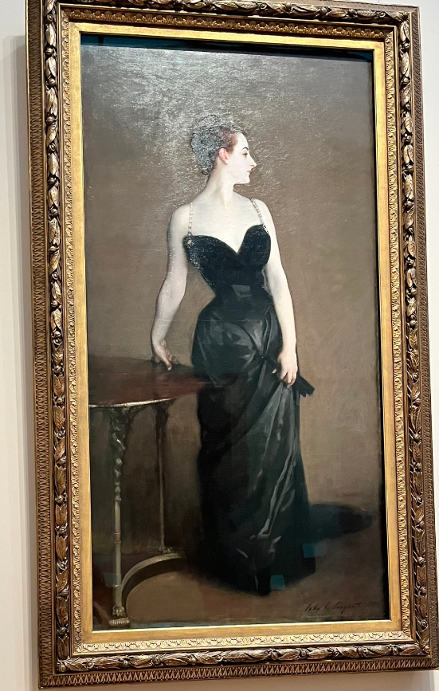

（未完待续）

如果你只想了解大都会艺术博物馆的几个著名的作品，可以直接看 “2. 重要作品介绍”部分。

## 1. 写在前面

- 如果你是纽约学生或者居住在纽约，只要提供纽约的有效地址，就能几乎免费逛。捐赠1美分就可以了！而且同行的人，只要有一个纽约人，整个团队都能几乎免费进了。对纽约居民非常棒的优惠！
- 官网有一些画的解说，走到画的前面，看标签有没有stop number，在网站输入，就能听解说了！中文的解说很少，英文的多。这个是[audio guide 链接](https://www.metmuseum.org/audio-guide)。或者直接谷歌搜索the met art museum audio guide就行。里面有免费wifi。

## 2. 重要作品介绍

### 2.1 欧洲展馆 European Paintings, 1300-1800

#### 睡莲 Water Lilies
19和20世纪应该是最后的地方，这里有梵高和莫奈。我最喜欢的一个painting是莫奈的睡莲，在Gallery 822 (https://www.metmuseum.org/art/collection/search/438008)：  
{: w="500" h="300" }
_Figure: Water Lilies_ 

关于莫奈与睡莲，董宇辉老师讲的这个非常好！这里是视频：[https://www.bilibili.com/video/BV1fH4y1E7wZ/?vd_source=a6cdf272e0acb7e9c6c08705bb2c9028](https://www.bilibili.com/video/BV1fH4y1E7wZ/?vd_source=a6cdf272e0acb7e9c6c08705bb2c9028)。我们引用一下： 
>你知道我为什么一直画睡莲吗？不懂得人说我画睡莲是因为习惯。只有我自己知道，我一直画睡莲是出于思念。  
Ref: 董宇辉

### 2.2 美洲展馆 The American Wing

#### George Washington's crossing of the Delaware River

著名的画 George Washington's crossing of the Delaware River，在这个展馆内。这个链接是画的详细[wiki介绍](https://en.wikipedia.org/wiki/George_Washington%27s_crossing_of_the_Delaware_River)。下图就是这个画了。  
{: w="500" h="300" }
_Figure: George Washington's crossing of the Delaware River_  

摘录一段关于这个画的wiki的原文：
>George Washington's crossing of the Delaware River, which occurred on the night of December 25–26, 1776, during the American Revolutionary War, was the first move in a complex and surprise military maneuver organized by George Washington, the commander-in-chief of the Continental Army, which culminated in their attack on Hessian forces garrisoned at Trenton. The Hessians were German mercenaries hired by the British.   
Ref: wiki  
译文：1776 年 12 月 25 日至 26 日晚，美国独立战争期间，乔治·华盛顿横渡特拉华河，这是大陆军总司令乔治·华盛顿组织的复杂而出其不意的军事行动的第一步，最终他们袭击了驻扎在特伦顿的黑森军队。黑森人是英国雇佣的德国雇佣兵。

华盛顿的伟大，一方面就体现在他能把权力移交出去。

#### Madame X

展馆里面有一幅比较著名的肖像画，是John Singer Sargent画的，这个画的详细介绍在[wiki的链接](https://en.wikipedia.org/wiki/Portrait_of_Madame_X)：  
{: w="500" h="300" }
_Figure: Madame X_  

我们应用这个[Guide to The Metropolitan Museum](https://github.com/BaosenZ/baosenz.github.io/blob/main/assets/blog_files/files_blog20250111/Guide_to_The_Metropolitan_Museum_of_Art_1972.pdf)书里面的来介绍：  
>Also at home in London was John Singer Sargent, who enjoyed extraordinary international success as a portrait painter. Of the many portraits in the Metropolitan, one of the most famous is his painting of Madame X—Madame Pierre Gautreau; when exhibited in 1884 the picture of this great Parisian beauty was received with derision because of the daring dress and odd skin color. Sargent himself sold it to the Museum in 1916, terming it perhaps his best picture. Later in his life he liked to paint mostly landscapte and water colors.    
Ref: Guide to The Metropolitan Museum
译文：同样在伦敦居住的还有约翰·辛格·萨金特，他作为肖像画家在国际上取得了非凡的成就。在大都会博物馆的众多肖像画中，最著名的一幅是他为皮埃尔·高特罗夫人（Madame Pierre Gautreau）所作的画作；1884 年展出时，这位巴黎大美人的画像因其大胆的着装和奇怪的肤色而遭到嘲笑。萨金特本人于 1916 年将其卖给了博物馆，称这可能是他最好的画作。晚年他喜欢画风景画和水彩画。

## 3. 写在最后

我希望把这个博客做成一个长期更新的博客。因为可能会去好几次才能把这个博物馆认真转完。

## Reference

1. 官网 audio guide 链接: [https://www.metmuseum.org/audio-guide](https://www.metmuseum.org/audio-guide)
2. 关于莫奈，董宇辉老师讲的非常好！这里是视频：[https://www.bilibili.com/video/BV1fH4y1E7wZ/?vd_source=a6cdf272e0acb7e9c6c08705bb2c9028](https://www.bilibili.com/video/BV1fH4y1E7wZ/?vd_source=a6cdf272e0acb7e9c6c08705bb2c9028)
3. George Washington crossing of the Delaware River wiki介绍：[https://en.wikipedia.org/wiki/George_Washington%27s_crossing_of_the_Delaware_River](https://en.wikipedia.org/wiki/George_Washington%27s_crossing_of_the_Delaware_River)
4. 博物馆官网提供了一本不错的参考书: [Guide to The Metropolitan Museum](https://resources.metmuseum.org/resources/metpublications/pdf/Guide_to_The_Metropolitan_Museum_of_Art_1972.pdf)
1. 我的小红书  相关链接：[https://www.xiaohongshu.com/discovery/item/67835360000000002001d914?source=webshare&xhsshare=pc_web&xsec_token=ABZTq9bZ7gA9T43baJFQRXUsp52ZlwJUktYtIKmYO8KpI=&xsec_source=pc_share](https://www.xiaohongshu.com/discovery/item/67835360000000002001d914?source=webshare&xhsshare=pc_web&xsec_token=ABZTq9bZ7gA9T43baJFQRXUsp52ZlwJUktYtIKmYO8KpI=&xsec_source=pc_share)

